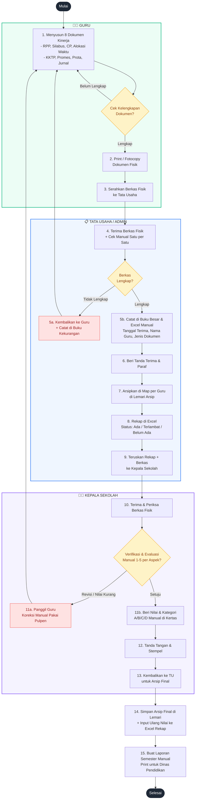
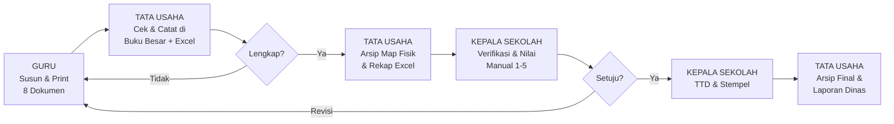

# FLOWMAP SISTEM BERJALAN (MANUAL) - E-KINERJA GURU SD N 1 PANCOR
> Kondisi Saat Ini: Belum Ada Sistem Komputerisasi, Masih Manual (Kertas & Excel)

## Diagram Flowmap Sistem Berjalan

### Alternatif Tampilan Swimlane Horizontal (Lebih Rapi untuk Skripsi)

---

## Penjelasan Alur (Narasi Flowmap)

| No | Pelaku | Proses | Dokumen / Output | Keterangan Manual |
|---|---|---|---|---|
| 1 | Guru | Menyusun 8 dokumen kinerja | File Word/Excel di Laptop Guru (belum terpusat) | Dikerjakan masing-masing, format tidak standar |
| 2 | Guru | Cetak & Fotocopy | Berkas Fisik 8 Dokumen | Boros kertas, resiko hilang |
| 3 | Guru -> TU | Penyerahan Fisik | Tanda Terima Tulisan Tangan | Antri, tidak ada bukti digital |
| 4 | TU | Pencatatan Manual | Buku Besar + File Excel di 1 Komputer | Rawan salah input, tidak realtime |
| 5 | TU | Pengarsipan | Map Plastik per Guru di Lemari | Sulit dicari, lemari penuh, rawan rusak |
| 6 | Kepsek | Penilaian Manual | Lembar Penilaian Kertas (Nilai 1-5, Kategori A-D) | Hitung manual pakai kalkulator, lama |
| 7 | Kepsek | Revisi | Coretan Pulpen di Kertas | Tidak ada history perubahan |
| 8 | TU | Laporan Akhir | Print-out Rekap Excel untuk Dinas | Harus rekap ulang tiap semester |

## Kelemahan Sistem Berjalan (Untuk Justifikasi BAB I & III Skripsi)

| Masalah | Dampak |
|---|---|
| **Tidak ada database terpusat** | Data tersebar di laptop masing-masing guru |
| **Pencatatan di buku & 1 file Excel** | Tidak bisa diakses bersamaan, tidak realtime |
| **Arsip Fisik di Lemari** | Pencarian lama, dokumen hilang/rusak karena banjir/rayap |
| **Penilaian Hitung Manual** | Rawan salah hitung rata-rata & kategori |
| **Tidak ada deadline system** | Guru sering terlambat tanpa notifikasi |
| **Tidak ada history revisi** | Tidak tau siapa mengubah nilai kapan |
| **Laporan ke Dinas Lambat** | Harus rekap manual berhari-hari |

## Simbol Flowmap yang Digunakan

- Oval = Terminator (Mulai/Selesai)
- Persegi Panjang = Proses Manual
- Belah Ketupat = Keputusan (Decision)
- Dokumen = Berkas Fisik / Print-out
- Panah = Alur Dokumen

> File ini siap dimasukkan ke BAB III Analisis Sistem Berjalan. Untuk Flowmap Sistem Usulan (Terkomputerisasi) lihat `flowchart-e-kinerja-guru.md`
