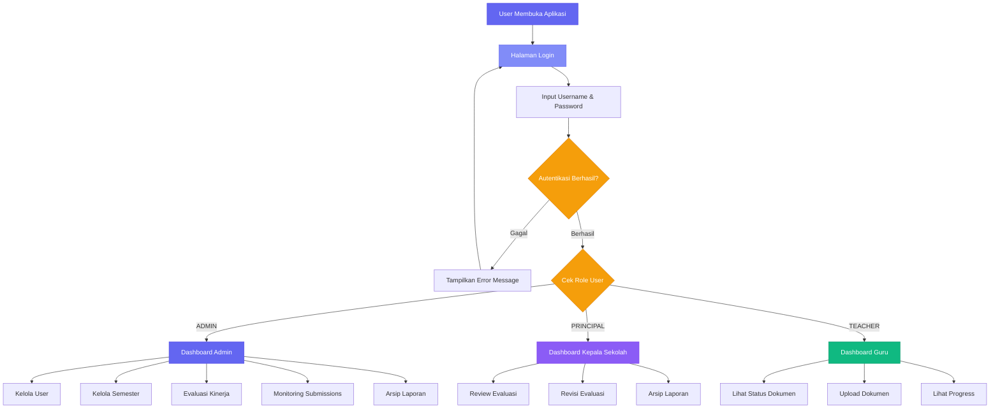
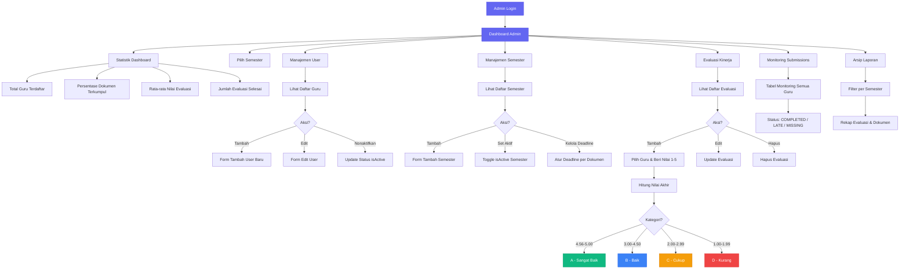
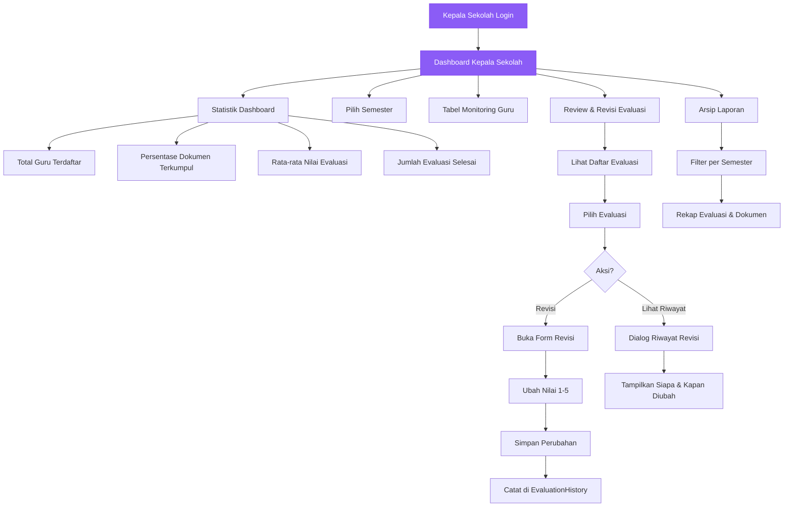
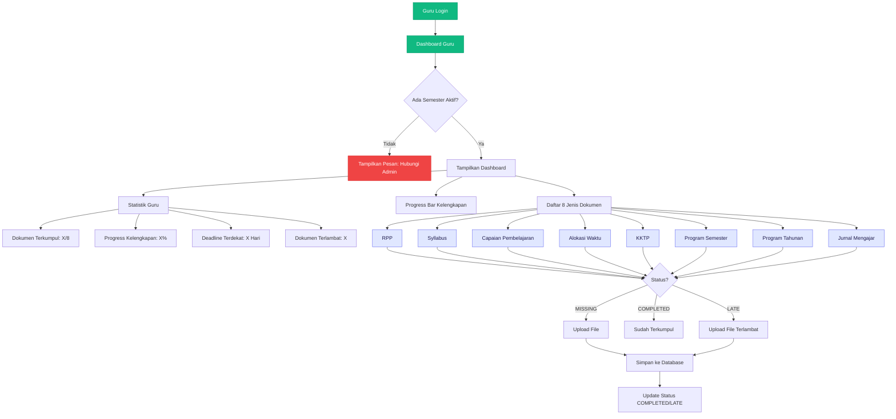
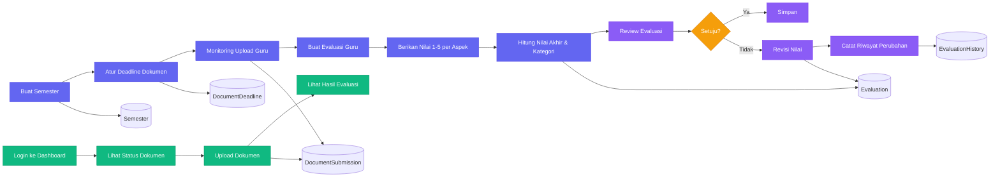
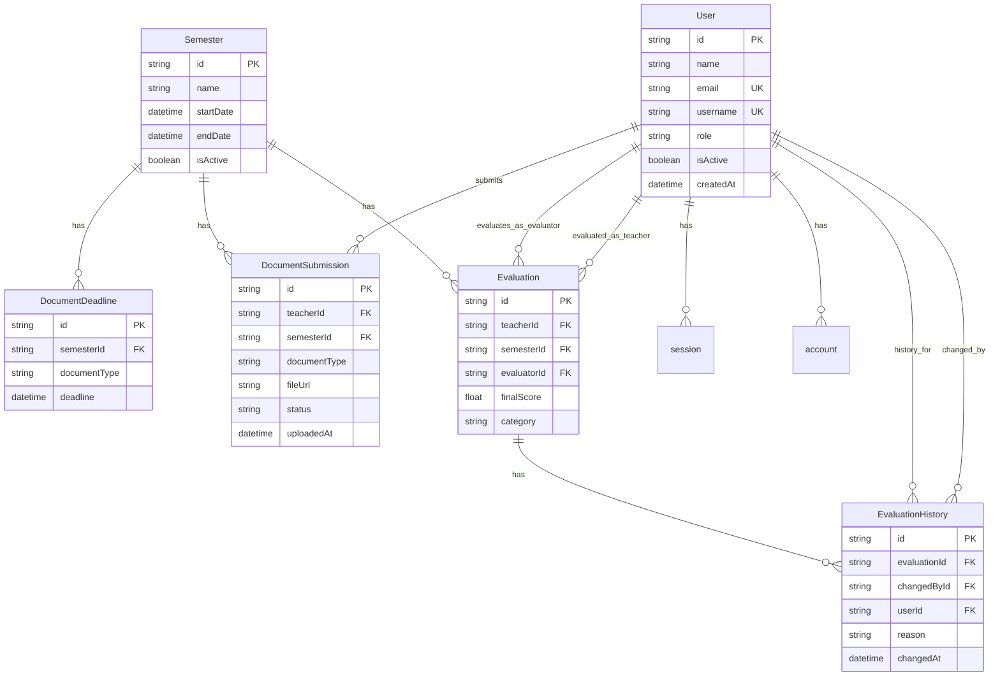
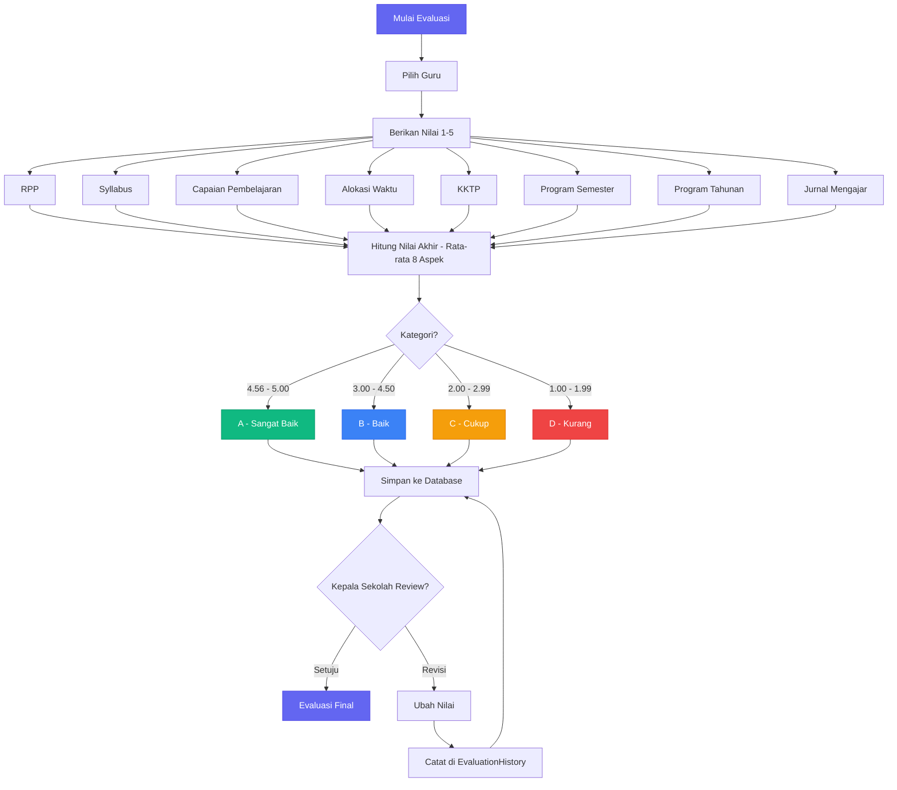

# Flowchart E-Kinerja Guru - SD N 1 Pancor

## 1. Flowchart Utama (Autentikasi & Navigasi Role)

## 2. Flowchart Admin

## 3. Flowchart Kepala Sekolah (Principal)

## 4. Flowchart Guru (Teacher)

## 5. Flowchart Proses Evaluasi (End-to-End)

## 6. Flowchart Database Schema (ERD)

## 7. Flowchart Kategori Evaluasi (Penilaian)

---

**Keterangan Warna:**
- **Indigo** = Proses Admin
- **Violet** = Proses Kepala Sekolah
- **Emerald** = Proses Guru
- **Amber** = Keputusan/Kondisi
- **Merah** = Error/Status Kritis
- **Biru** = Kategori Baik
